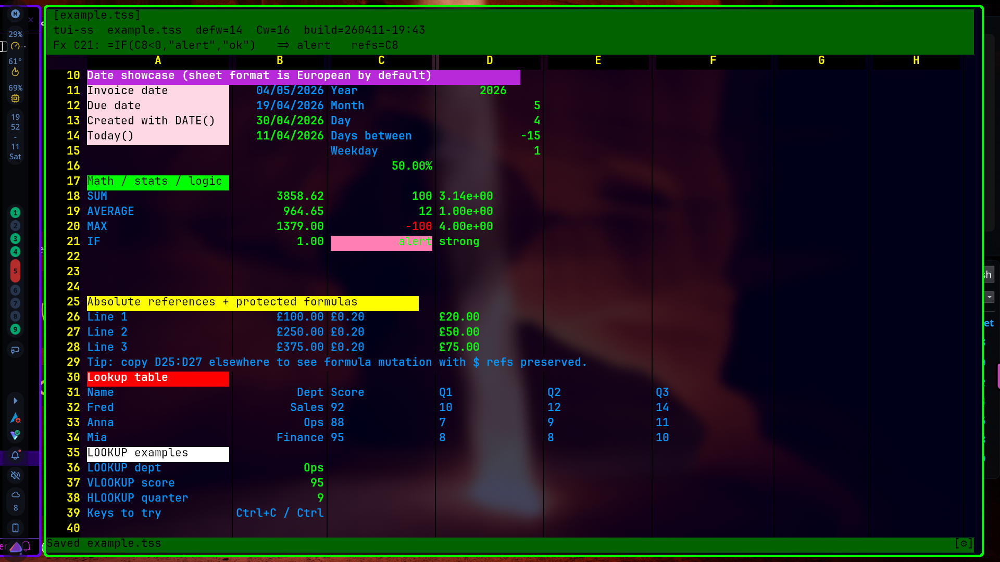
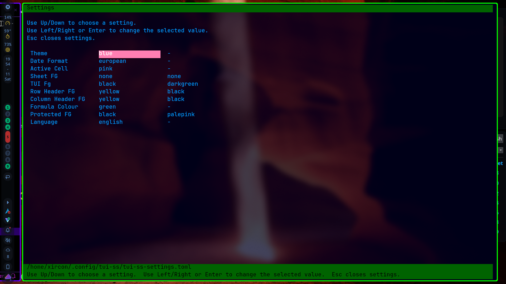
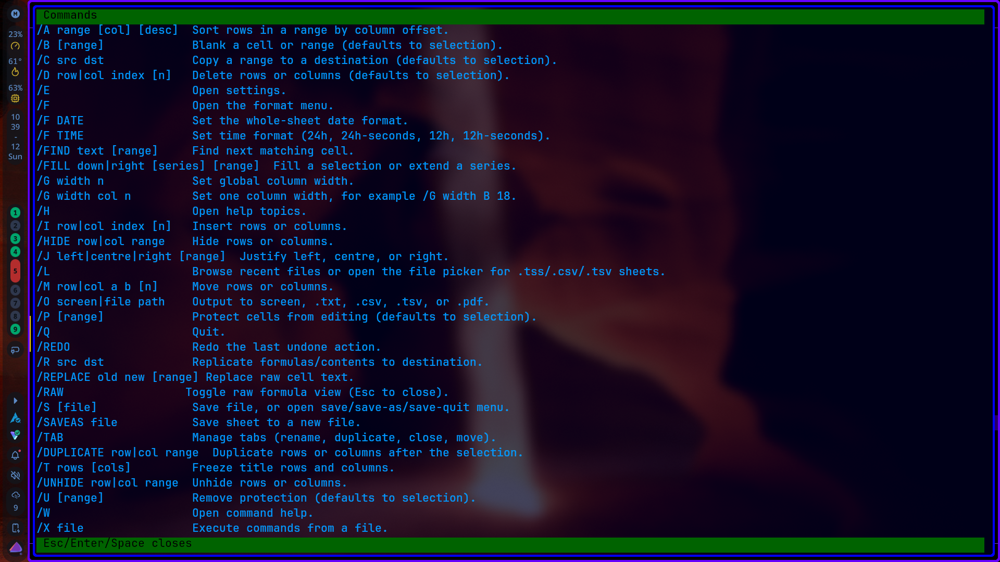

#!/usr/bin/env markdown
# tui-ss

A modular terminal spreadsheet with a SuperCalc-style slash command workflow. This is AI slop.

## Controls

- Arrow keys or `hjkl`: move
- `Shift` + arrows: grow/shrink a rectangular selection
- `Shift+Space` or `Ctrl+G`: select the current row
- `Ctrl+Space`: select the current column
- `Enter`: move in the last arrow direction
- `Home` / `End`: jump to the first or last visible column
- `Tab`: move right
- `Ctrl+S`: save
- `Ctrl+Q`: quit
- `Ctrl+C`: copy the current cell or selection
- `Ctrl+V` or `Ctrl+Y`: paste the copied block
- `Ctrl+P`: paste values only
- `Ctrl+K`: copy formatting from the current cell or selection
- `Ctrl+O`: paste formatting to the current cell or selection
- `Ctrl+L`: clear formatting on the current cell or selection
- `Ctrl+Z`: undo
- `Ctrl+R`: redo
- `Ctrl+F`: repeat the last find
- `Ctrl+W`: autosize the current column or selected columns
- `Ctrl+T`: insert the current date
- `Ctrl+N`: insert the current time
- `Ctrl+D`: duplicate the current row
- `Ctrl+A`: duplicate the current column
- `Ctrl+X` or `F2`: edit the current cell
- `Ctrl+E`: edit the current cell in the formula bar
- `Ctrl+B`: toggle bold
- `Ctrl+U`: toggle underline
- `Ctrl+I`: toggle italic
- `F1`: toggle keybinding overlay
- `/`: open the slash command menu
- `Esc`: cancel the current prompt
- Click a tab at the top: switch open files
- Click the bottom-right cog: open settings
- Mouse wheel / touchpad: scroll

## Slash Help

Pressing `/` now shows the command reference while you type. You can use either the long form command names or the classic one-letter forms.

- `/A range [col] [desc]`: arrange and sort rows in a range
- `/B [range]`: blank the current cell or a range
- `/C src dst`: copy a source range to a destination
- `/CF src dst`: copy formatting only from a source range to a destination
- `/D row|col index [n]`: delete rows or columns
- `/E [cell] value`: edit the current or named cell
- `/F style [range]`: format cells as `clear-format`, `text`, `currency`, `fixed`, `percent`, `int`, `negative`, `accounting`, or `sci`
- `/F date`: change the whole-sheet date format with a horizontal `european` / `us` / `ansi` menu
- `/F time`: change the whole-sheet time format with a horizontal `24h` / `24h-seconds` / `12h` / `12h-seconds` menu
- `/F`: open a horizontal format menu you can drive with arrows or typing
- `/FIND text [range]`: find the next matching cell
- `/FINDALL text [range]`: list all matching cells and jump to one
- `/FINDPREV [text] [range]`: find the previous matching cell
- `/FILL down|right [series] [range]`: fill a selection or extend a series
- `/FREEZE top [n]`: freeze top rows quickly
- `/FREEZE left [n]`: freeze left columns quickly
- `/FREEZE clear`: clear frozen rows and columns
- `/W 18`: set the width for the current column or selected columns
- `/W auto`: autosize the current column or selected columns
- `/W visible`: autosize every visible column in the sheet
- `/J left|centre|right [range]`: justify cells left, centre, or right
- `/I row|col index [n]`: insert rows or columns
- `/L file`: load a `.tss`, `.csv`, or `.tsv` file in a new tab
- `//IMPORT file [cell]`: import a `.tss`, `.csv`, or `.tsv` sheet into the current sheet at the active cell or a target like `D5`
- `/M row|col a b [n]`: move rows or columns
- `/O screen|file path`: output to the screen or a `.csv` / `.tsv` / `.pdf` / text snapshot
- `/P [range]`: protect cells from editing
- `/Q`: quit
- `/REDO`: redo the last undone action
- `/R src dst`: replicate a source range into a destination block
- `/REPLACE old new [range]`: replace raw text in cells
- `/RAW`: toggle raw formula view (Esc to close)
- `/S [file]`: save directly, or with no argument open a `save` / `save-as` / `save-quit` menu
- `/SAVEAS file`: save the sheet to a new file
- `/TAB`: manage tabs (rename, duplicate, close, move)
- `/T`: open a row/column freeze menu
- `/T rows [cols]`: freeze title rows and columns by count
- `/T row 1:3 col A:B`: freeze through a row and column range
- `/TRANSFORM action [range]`: apply `trim`, `upper`, `lower`, `proper`, `dedupe`, or `compact`
- `/SORT range [col] [desc]`: alias for `/A`
- `/U [range]`: remove protection
- `/W`: open a `manual` / `auto` width menu
- `/X file`: execute commands from a text file
- `/Z`: zap the whole workspace
- `/GO cell`: jump to a cell like `B12`

## Examples

- `/E A1 125`
- `/E B1 =A1*2`
- `/FIND Banana`
- `/FINDALL Banana`
- `/FINDPREV Banana`
- `/FREEZE top 2`
- `/FREEZE left 1`
- `/REPLACE old new A:A`
- `/C A1:B3 D1`
- `/C A1 B1:B10`
- `/F currency A1:B10`
- `/F date`
- `/F time`
- `/F clear-format A1:C10`
- `/F negative B1:B10`
- `/F accounting C1:C10`
- `/F`
- `/J centre A1:C10`
- `/W 18`
- `/W visible`
- `/TRANSFORM trim A1:A20`
- `/TRANSFORM dedupe A2:D40`
- `/A A1:C20 1`
- `/I row 5 2`
- `/D col 3 1`
- `/P A1:C3`
- `/U B2`
- `/S ~/sheets/budget.tss`
- `/O file ~/sheets/budget.pdf`
- `/SAVEAS ~/sheets/budget-copy.tss`
- `/L ~/sheets/budget.tss`
- `//IMPORT ~/data/prices.csv`
- `//IMPORT ~/data/prices.csv D5`
- `/X ~/scripts/tui-ss/demo.commands`

## Notes

- `.tss` files store cells, formats, protection, title freeze settings, column width, theme choice, and alignment metadata.
- You can open multiple files at once; each file gets its own tab at the top.
- The sheet has one date format for display and input. Default is European `dd/mm/yyyy`.
- The sheet has one time format for display and input. Default is `24h`.
- Theme and date format can be changed in the settings screen from the bottom-right cog.
- Settings are saved to `~/.config/tui-ss/tui-ss-settings.toml`.
- Individual column widths are saved in `.tss` files.
- CSV and TSV load/save are supported.
- `//IMPORT` respects protected destination cells and shifts imported formulas to the destination block.
- Protected cells are marked with a leading `!` in the grid.
- Title rows and columns are emphasized in the display.
- Frozen rows and columns get stronger header markers and divider lines.
- The top formula bar is always visible and shows the current cell raw text, format, and selection context.
- Clicking a row header freezes rows through that row.
- Clicking a column header freezes columns through that column.
- Formula cells are drawn in bright green.
- Formula coloring can be switched off or changed in Settings.
- `negative` format draws negative numbers in red.
- `accounting` format shows negative numbers in brackets.
- `Alt+=` inserts a `SUM(...)` formula for the numeric cells above the current cell.
- Formula functions include `ABS`, `AVERAGE`, `AVG`, `COS`, `COUNT`, `COUNTIF`, `IF`, `IFERROR`, `INT`, `LOOKUP`, `MATCH`, `INDEX`, `SUMIF`, `VLOOKUP`, `HLOOKUP`, `MAX`, `MIN`, `MOD`, `ROUND`, `SIN`, `SQRT`, and `SUM`.
- Date functions include `DATE`, `TODAY`, `YEAR`, `MONTH`, `DAY`, `DATEDIFF`, and `WEEKDAY`.
- Time functions include `TIME`, `NOW`, `HOUR`, `MINUTE`, `SECOND`, and `TIMEVALUE`.
- With the default European sheet format, entering `05/04/2026` stores the date and displays it as `05/04/2026`.
- Formula entry supports arrow-key pointing after `=` and inside ranges such as `=SUM(` ... `:` ... `Enter`.
- Absolute references are supported: `$A$1`, `$A1`, and `A$1`.
- Examples: `=IF(A1=10,1,0)`, `=AVERAGE(B1:B5)`, `=COS(0)`, `=LOOKUP("Fred",A1:A10,B1:B10)`, `=COUNTIF(A1:A10,"Fred")`, `=SUMIF(A1:A10,"Fred",B1:B10)`.
- `COUNTIF` and `SUMIF` criteria can be exact values like `"Fred"` or operator strings like `">10"`, "`<=5`", and `"<>"`.
- Selection stats in the bottom bar show count/sum/avg/min/max for numeric values.
- Selection stats also show formula and protected-cell counts when present.
- Command help, key help, and formula help are scrollable with arrows, `PgUp`, `PgDn`, `Home`, and `End`.
